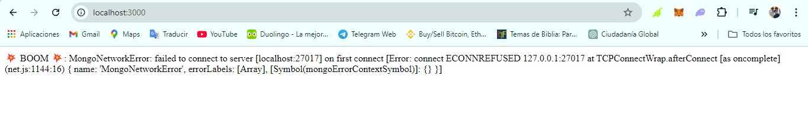

# Taller Práctico de Docker – Comunicación entre Contenedores en Redes Distintas

## Objetivo

Lograr que dos contenedores conectados a redes distintas se comuniquen entre sí, uno con una aplicación web y el otro con una base de datos MongoDB.

## Pasos Realizados

### 1. Clonación del Proyecto de Platzi y Construcción de la Imagen


**Comando:**
```bash
git clone https://github.com/platzi/docker
cd docker
docker build -t platziapp .
```

Clonamos el repositorio del proyecto de Platzi como ejemplo y construimos la imagen Docker a partir del `Dockerfile` presente en el repositorio. Nombramos la imagen como `platziapp`.

### 2. Ejecución del Contenedor de la Aplicación


**Comando:**
```bash
docker run --rm -p 3000:3000 platziapp
```

Creamos y ejecutamos un contenedor basado en la imagen `platziapp`, mapeando el puerto 3000 del contenedor al puerto 3000 del host.

### 3. Verificación en el Navegador



Al acceder al puerto 3000 en `localhost`, notamos que la aplicación no tiene conexión con una base de datos.

### 4. Detenemos el Contenedor de la Aplicación


**Comando:**
```bash
docker ps
docker stop distracted_cohen
```

Detenemos el contenedor de la aplicación utilizando el nombre que obtenemos con `docker ps`.

### 5. Creación de una Nueva Red para Conectar los Contenedores


**Comando:**
```bash
docker network ls
docker network create --attachable platzinet
docker network ls
```

Creamos una nueva red llamada `platzinet` para que los dos contenedores puedan comunicarse. Verificamos la creación de la red con `docker network ls`.

### 6. Creación y Ejecución del Contenedor de la Base de Datos


**Comando:**
```bash
docker run -d --name db mongo
```

Creamos y ejecutamos un contenedor de MongoDB llamado `db` en segundo plano (`-d`), basado en la imagen oficial de `mongo`.

### 7. Conectar el Contenedor de la Base de Datos a la Red


**Comando:**
```bash
docker network connect platzinet db
docker network inspect platzinet
```

Conectamos el contenedor `db` a la red `platzinet` y verificamos que esté conectado inspeccionando la red con `docker network inspect`.

### 8. Ejecución del Contenedor de la Aplicación con Conexión a la Base de Datos


**Comando:**
```bash
docker run -d --name app -p 3000:3000 --env MONGO_URL=mongodb://db:27017/test platziapp
```

Creamos y ejecutamos el contenedor `app` basado en la imagen `platziapp`, mapeando el puerto 3000 al host y configurando la variable de entorno `MONGO_URL` para que apunte al contenedor de la base de datos `db`, usando el protocolo MongoDB en el puerto 27017.

### 9. Conectar el Contenedor de la Aplicación a la Red


**Comando:**
```bash
docker network connect platzinet app
docker network inspect platzinet
```

Conectamos el contenedor `app` a la red `platzinet` y verificamos nuevamente con `docker network inspect` que ambos contenedores (`app` y `db`) están en la misma red.

### 10. Verificación en el Navegador


Finalmente, abrimos el puerto 3000 en el navegador (`localhost:3000`) y confirmamos que la aplicación está conectada a la base de datos y funcionando correctamente.

## Conclusión

En este taller hemos aprendido a conectar dos contenedores de Docker a una red personalizada para que puedan comunicarse entre sí, uno ejecutando una aplicación web y el otro una base de datos MongoDB.